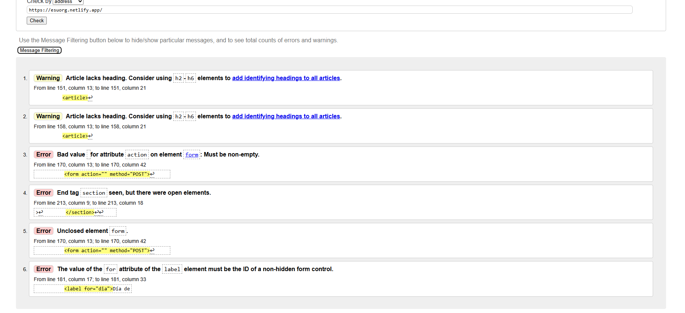
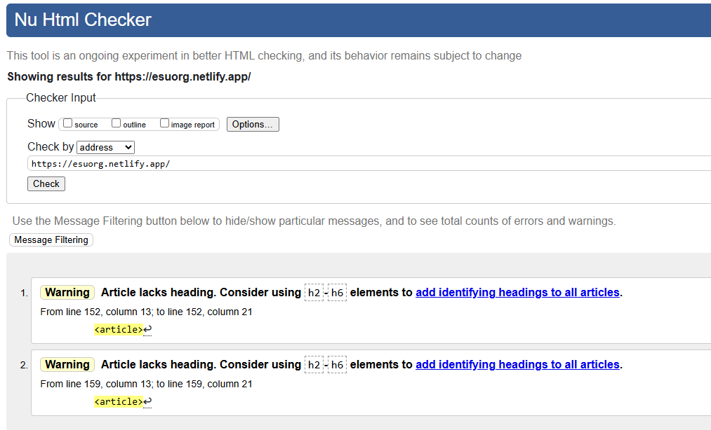
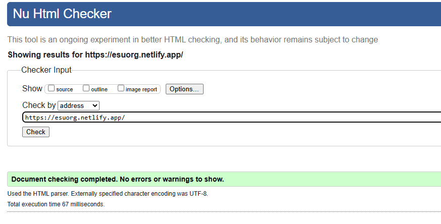
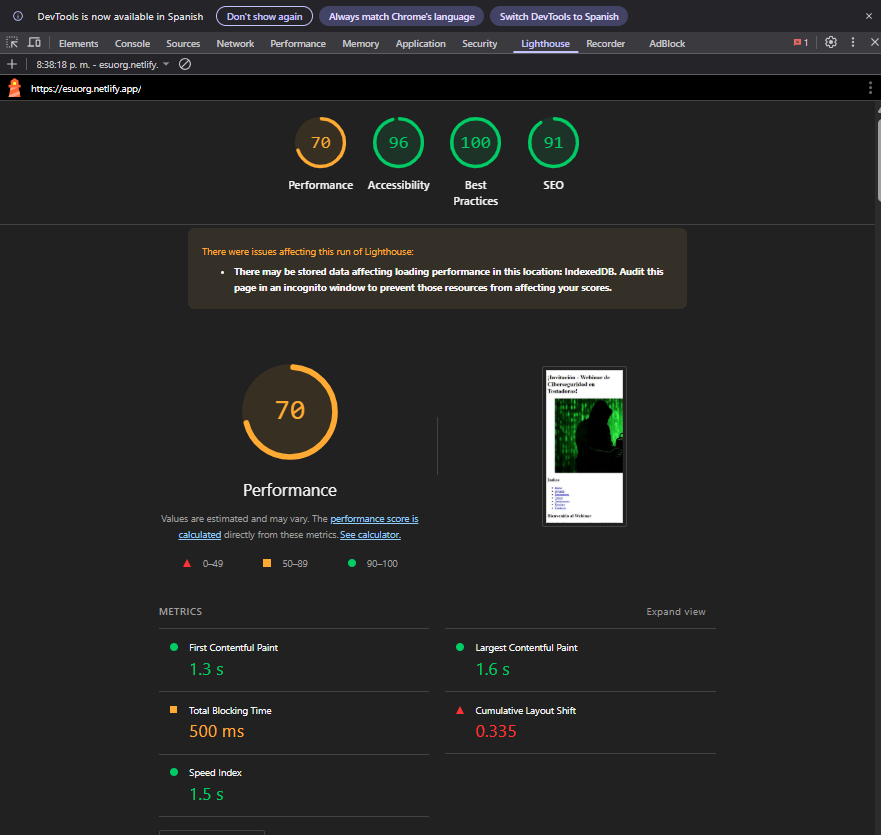
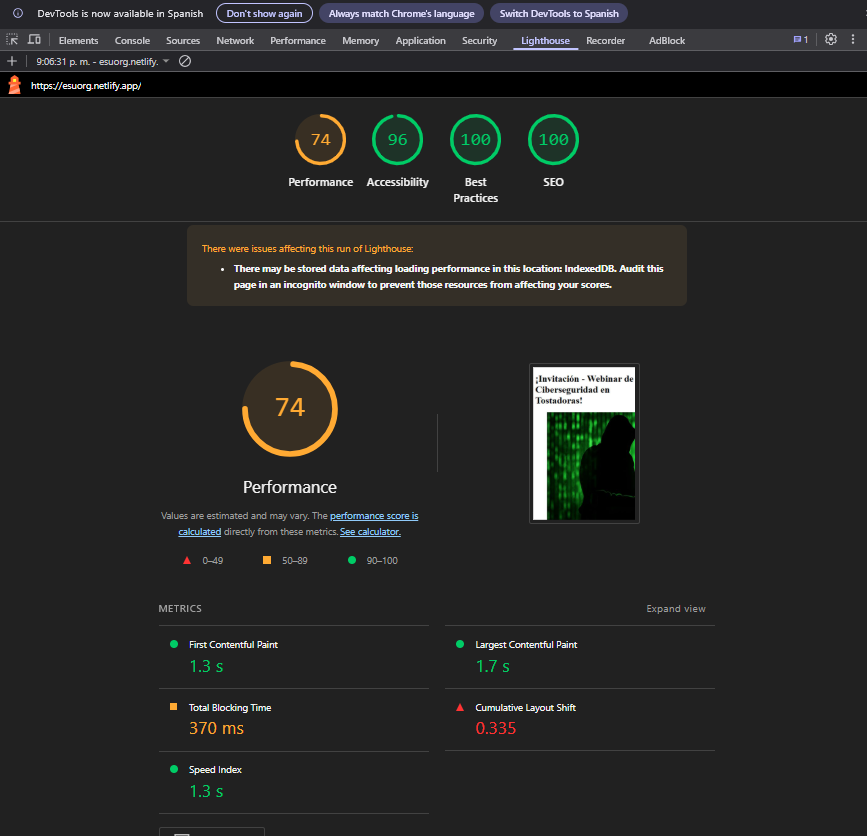

# Webinar de Ciberseguridad en Tostadoras IoT 

💻 **Laboratorio 2 - Portafolio 01**  

**Nombre:** Eyden Su Díaz
**Carné:**  *2023025837*
**Curso:**  IC-8057 – Introducción al Desarrollo de Páginas Web  
**Fecha:**  15/8/2025

---

## 📝 Descripción
Sitio web informativo para un webinar ficticio sobre vulnerabilidades de ciberseguridad en dispositivos IoT cotidianos (tomado como ejemplo y clickbait: tostadoras inteligentes). Incluye:
- Agenda detallada
- Perfiles de expositores
- Formulario de registro
- Testimonios
- Preguntas frecuentes

---

## 🏗️ Estructura Semántica HTML
### Etiquetas clave y su propósito:
| Etiqueta          | Uso                                                                 |
|-------------------|---------------------------------------------------------------------|
| `<header>`        | Cabecera con título principal                                      |
| `<nav>`           | Menú de navegación con anclajes internos                           |
| `<main>`          | Contenido principal del sitio                                      |
| `<section>`       | Divide secciones temáticas (agenda, expositores, etc.)             |
| `<article>`       | Contenido independiente (testimonios)                              |
| `<figure>`        | Agrupa imágenes con sus descripciones (`<figcaption>`)             |
| `<aside>`         | Contenido complementario (noticias y redes sociales)               |
| `<footer>`        | Información de cierre (copyright)                                  |

---

## 🌐 URL Pública Netlify
🔗 [https://esuorg.netlify.app/](https://esuorg.netlify.app/)

---

## ✔️ Validación W3C
### Resumen:



- **HTML**: 4 errores, 2 warnings
La primera vez que se realizó la validación, existían errores. Primeramente por el form que estaba linkeando un `action` vacío. También no se cerró el `<form>`. Luego de los cambios solo quedaron los warnings como se muestra a continuación.



- **HTML**: 0 errores, 2 warnings ([Ver validación](https://validator.w3.org/nu/?doc=https%3A%2F%2Fesuorg.netlify.app%2F))

Los warnings se indican en la parte de "Testimonios" donde los `article` no tienen un encabezado (h2-h6). 

### Problema Actual:
```html
    <article>
        <blockquote>
            <p><em>"Este webinar me abrió los ojos..."</em></p>
            <footer>— Elder L.</footer>
        </blockquote>
    </article>
```

Una forma de solución podría ser el utilizar `aria-label` en esos artículos ya que poner encabezados puede ser muy redundante.

### Solución Corregida:
```html
    <article aria-label="Testimonio de Elder L.">
        <blockquote>
            <p><em>"Este webinar me abrió los ojos sobre la seguridad de mis dispositivos en la casa. ¡Altamente recomendado!"</em></p>
            <footer>— Elder L.</footer>
        </blockquote>
    </article>

    <article aria-label="Testimonio de Brasly V.">
        <blockquote>
            <p><em>"Excelente información y muy bien presentado. Aprendí mucho sobre cómo proteger mi hogar inteligente."</em></p>
            <footer>— Brasly V.</footer>
        </blockquote>
    </article>
```

Cambiar esto trae los siguientes beneficios:
1. **Mejora la accesibilidad**: Los screen readers pueden identificar mejor cada testimonio
2. **Valida correctamente**: Cumple con los estándares W3C
3. **Mantiene la semántica**: Cada artículo tiene ahora un título identificativo
4. **Mejor SEO**: Los encabezados ayudan a los motores de búsqueda a entender la estructura del HTML

### Validación final en W3C



> ✅ Una vez aplicado los `aria-label` en los `article` no muestra errores

---

## ⚡ Lighthouse (Puntuaciones)

### Primera prueba de Lighthouse


| Categoría         | Puntuación (0-100) | Plan de Mejoras                          |
|-------------------|--------------------|------------------------------------------|
| Rendimiento       | 70                 | Optimizar imágenes con formatos WebP     |
| Accesibilidad    | 96                | Mantener estructura semántica y tamaños más accesibles de vínculos, radiobuttons y botones.           |
| Mejores Prácticas| 100                | -                                        |
| SEO              | 91                | Uso más exhaustivo de identificadores aria para lectores|

### Segunda prueba de Lighthouse



| Categoría         | Puntuación (0-100) | Plan de Mejoras                          |
|-------------------|--------------------|------------------------------------------|
| Rendimiento       | 74                 | Optimizar imágenes con formatos WebP     |
| Accesibilidad    | 96                | Tamaños más accesibles de vínculos, radiobuttons y botones|
| Mejores Prácticas| 100                | -                                        |
| SEO              | 100                | -                                        |

> 📑NOTA: Estos puntos a mejorar (imágenes y tamaños) se tiene contemplado tratarlos en la parte de diseño, este laboratorio se centraba más en la estructura semántica del HTML y sus componentes.

---

## ♿ Accesibilidad Aplicada
### 1. **`tabindex`**
- Uso: `tabindex="-1"` en imágenes decorativas (ej: banner principal) para excluirlas del tabulado.
```html
    <figure>
        
    </figure>
```
- **¿Por qué?**: Evita distracciones en la navegación por teclado.

### 2. **Atributos `aria-*`**
- `aria-label="Navegación principal"` en `<nav>`.

```html
    <nav aria-label="Navegación principal del sitio"> <!-- ! -->
        <h2>Índice</h2>
        <ul>
            <li><a href="#inicio">Inicio</a></li>
            <li><a href="#agenda">Agenda</a></li>
            <li><a href="#exponentes">Exponentes</a></li>
            <li><a href="#temas">Temas</a></li>
            <li><a href="#testimonios">Testimonios</a></li>
            <li><a href="#registro">Registro</a></li>
            <li><a href="#contacto">Contacto</a></li>
        </ul>
    </nav>
```
- **¿Por qué?**: Ayuda a lectores de pantalla a entender la estructura.

### 3. **Textos `alt`**
- Descriptivos en todas las imágenes (ej: `alt="Hacker encapuchado frente a una tostadora con códigos binarios en pantalla"`).
```html
    <figure>
        
    </figure>
```
- **¿Por qué?**: Contexto para usuarios con discapacidad visual.

### 4. **Enlaces descriptivos**
Se evitó el uso de textos genéricos como "clic aquí" o "leer más"

Cada enlace contiene texto autoexplicativo que describe su destino

Enlaces a redes sociales usan el nombre de la plataforma como texto visible
  ```html
    <!-- Enlace descriptivo a contenido -->
    <li>
        <a href="https://example.com/noticia1" 
        rel="noopener noreferrer">
        Nuevo ataque a dispositivos IoT  <!-- Texto específico sobre el destino -->
        </a>
    </li>

    <!-- Enlaces a redes sociales -->
    <li>
        <a href="https://instagram.com/webinar_ciberseguridad"
        target="_blank" 
        rel="noopener noreferrer"
        aria-label="Seguínos en Instagram (se abre en nueva ventana)">
        Instagram  <!-- Nombre reconocible de la plataforma -->
        </a>
    </li>
  ```